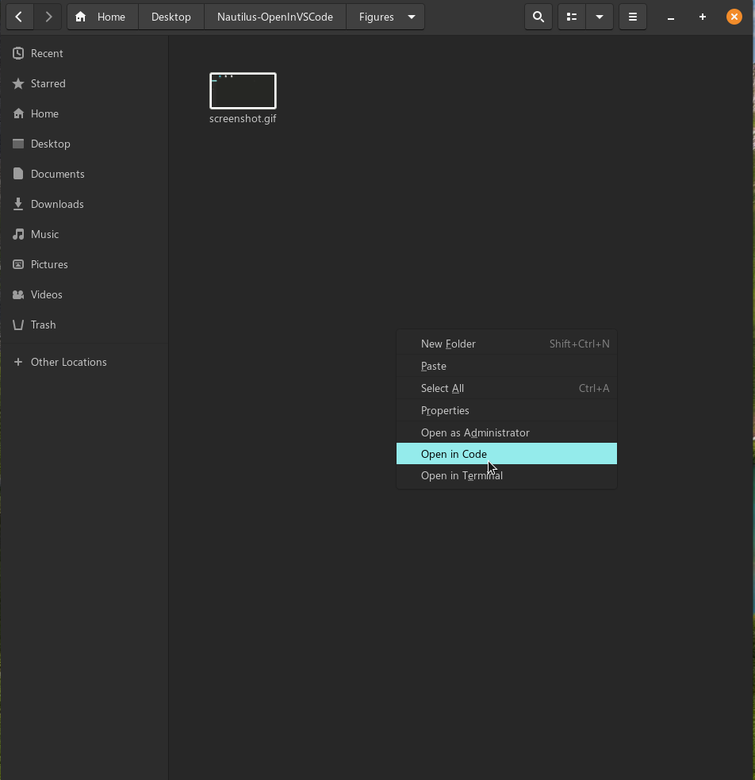
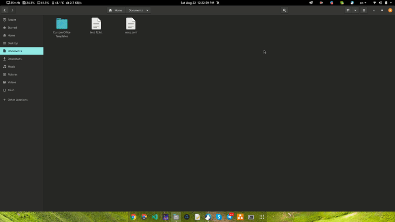

# Nautilus context menu: Open in VSCode
Dependency to install before: `nautilus-python` (`python3-nautilus` package on Debian / Ubuntu)
- Debian / Ubuntu
    ```bash
    sudo apt install python3-nautilus
    ```  
- Fedora
    ```bash
    sudo dnf install nautilus-python
    ```
## Note
- If you use Gnome verison <= 42 please check branch [gnome-42](https://github.com/vvanloc/Nautilus-OpenInVSCode/tree/gnome-42)
- If you install vscode from Snap Store, you must make symbolic links to /usr/bin/code
    ```bash
    sudo ln -s /snap/bin/code /usr/bin/code
    ```
    or
    ```bash
    sudo ln -s $(which code) /usr/bin/code
    ```

## Install 
- VSCode:
    ```bash
    ./install.sh
    or
    sudo ./install.sh
    ```
- VSCode Insider:
    ```bash
    ./install-insiders.sh
    or
    sudo ./install-insiders.sh
    ```
## Uninstall 
- Current User:
    ```bash
    rm ~/.local/share/nautilus-python/extensions/vscode-nautilus.py
    or
    rm ~/.local/share/nautilus-python/extensions/vscodeinsiders-nautilus.py
    ```
- All User:
    ```bash
    sudo rm /usr/share/nautilus-python/extensions/vscode-nautilus.py
    or
    sudo rm /usr/share/nautilus-python/extensions/vscodeinsiders-nautilus.py
    ```
### Restart Nautilus
```bash
nautilus -q
```
# Screenshot


